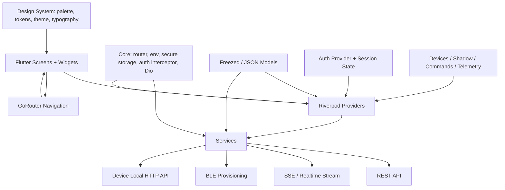

# Smart-Air Flutter Application Architecture Analysis

## 1. Project Overview

### Application purpose
Smart-Air is a mobile application for managing an indoor air-quality monitoring ecosystem. Its core responsibilities are:

- authenticating users and restoring sessions
- browsing homes, rooms, and devices
- provisioning new devices using BLE + local-device HTTP + cloud API coordination
- monitoring live telemetry and device shadow state
- sending control commands to device relays and operating modes
- displaying notifications and OTA/update flows
- presenting a brand-oriented mobile UI built around a custom design system

The app is designed as the client-facing control plane for the Smart-Air ecosystem, while the firmware and server provide the device and backend layers.

### Technology stack
The mobile application is implemented in Flutter and uses the following major technologies:

- Flutter SDK with Material Design
- Riverpod for state management
- GoRouter for screen routing and auth-redirection
- Dio for HTTP API access
- Flutter Secure Storage for token persistence
- flutter_blue_plus for BLE scanning and provisioning
- wifi_scan for Wi-Fi network discovery
- fl_chart for data visualization
- Google Fonts and a custom design system for typography and theming
- custom service adapters around the Smart-Air REST and SSE APIs

### Flutter version (identified)
The project declares:

- Flutter SDK environment: `>=3.10.0`
- Dart SDK environment: `>=3.0.0 <4.0.0`

This indicates the client targets Flutter 3.10+ and Dart 3.x.

### Main dependencies
From `app/pubspec.yaml`, the key dependency set is:

- `flutter_riverpod: ^2.5.1`
- `go_router: ^14.2.7`
- `dio: ^5.4.3`
- `flutter_secure_storage: ^9.2.2`
- `flutter_blue_plus: ^1.33.0`
- `permission_handler: ^11.3.1`
- `wifi_scan: ^0.4.1`
- `fl_chart: ^0.68.0`
- `google_fonts: ^6.2.1`
- `lucide_icons: ^0.257.0`

Important dev dependencies include:

- `flutter_test`
- `flutter_lints`
- `build_runner`
- `freezed`
- `json_serializable`
- `golden_toolkit`

### Overall architecture summary
The current app architecture is a layered, provider-driven Flutter app that follows a practical “feature + service + provider + UI” pattern.

The dominant pattern is:

1. UI screens and widgets render against Riverpod providers.
2. Providers orchestrate state for auth, homes, devices, telemetry, and notifications.
3. Services communicate with the backend and device networks via REST, BLE, and SSE.
4. Core infrastructure provides routing, environment configuration, tokens, and auth interception.
5. A custom design layer centralizes theme tokens and reusable UI assets.

At a high level, the application is not built around a formal Clean Architecture package structure, but it is deliberately layered and separated by concern.

---

## 2. Flutter Project Folder Structure

### Folder tree

```text
app/
├── analysis_options.yaml
├── DESIGN.md
├── pubspec.yaml
├── ui_mockup.html
├── android/
├── ios/
├── lib/
│   ├── app_state.dart
│   ├── app_theme.dart
│   ├── main.dart
│   ├── core/
│   │   ├── api_client.dart
│   │   ├── app_config.dart
│   │   ├── app_exception.dart
│   │   ├── auth_interceptor.dart
│   │   ├── back_navigation.dart
│   │   ├── env.dart
│   │   ├── router.dart
│   │   └── secure_storage.dart
│   ├── design/
│   │   ├── atmosphere_theme.dart
│   │   ├── icons.dart
│   │   ├── palette.dart
│   │   ├── text_styles.dart
│   │   └── tokens.dart
│   ├── models/
│   │   ├── command.dart
│   │   ├── command.freezed.dart
│   │   ├── command.g.dart
│   │   ├── device.dart
│   │   ├── device.freezed.dart
│   │   ├── device.g.dart
│   │   ├── home.dart
│   │   ├── home.freezed.dart
│   │   ├── home.g.dart
│   │   ├── notification_item.dart
│   │   ├── ota.dart
│   │   ├── realtime_event.dart
│   │   ├── telemetry.dart
│   │   ├── telemetry.freezed.dart
│   │   ├── telemetry.g.dart
│   │   ├── user.dart
│   │   ├── user.freezed.dart
│   │   └── user.g.dart
│   ├── providers/
│   │   ├── auth_provider.dart
│   │   ├── devices_provider.dart
│   │   ├── homes_provider.dart
│   │   ├── notifications_provider.dart
│   │   └── ota_provider.dart
│   ├── screens/
│   │   ├── auth/
│   │   ├── ble_scan_screen.dart
│   │   ├── devices/
│   │   ├── home_screen.dart
│   │   ├── homes/
│   │   ├── notifications_screen.dart
│   │   ├── profile/
│   │   ├── provision/
│   │   └── ui_mockup.dart
│   ├── services/
│   │   ├── auth_service.dart
│   │   ├── ble_models.dart
│   │   ├── ble_service.dart
│   │   ├── device_service.dart
│   │   ├── home_service.dart
│   │   ├── notification_service.dart
│   │   └── realtime_service.dart
│   └── widgets/
│       ├── add_device_sheet.dart
│       ├── async_value_widget.dart
│       ├── atoms/
│       ├── device_card.dart
│       └── shell/
├── linux/
├── macos/
├── windows/
├── test/
├── web/
└── assets/
    ├── fonts/
    └── images/
```

### Explanation of each folder/module

#### `lib/main.dart`
This is the application entry point. It:

- disables runtime font fetches for bundled fonts
- validates environment configuration
- blocks web builds with a dedicated unsupported-screen fallback
- creates a `ProviderScope` for Riverpod
- configures the `MaterialApp.router` with theme mode and router provider

This is the app bootstrap root.

#### `lib/core/`
This folder contains infrastructural logic used across the app, especially network, storage, auth, and route orchestration.

Key responsibilities:

- `api_client.dart` creates the global Dio client and injects secure storage
- `auth_interceptor.dart` handles token injection and refresh logic
- `secure_storage.dart` persists auth/session data locally
- `router.dart` defines the application’s route map and redirect logic
- `env.dart` validates runtime environment configuration
- `app_exception.dart`, `app_config.dart` provide central app-level exception/config helpers

This is the “infrastructure” layer.

#### `lib/design/`
This folder holds the visual design system and theming definitions.

Key responsibilities:

- tokens for spacing, radius, and visual primitives
- custom theme definitions for light/dark mode
- palette and color access helpers
- typography styles
- icons and reusable visual constants

`app_theme.dart` acts as a public export barrel for these values.

#### `lib/models/`
The model layer contains typed domain objects and generated code.

Key examples:

- `device.dart` for device status and metadata
- `home.dart` and `room` related model data
- `telemetry.dart` for air-quality sensor snapshots
- `command.dart` for device commands and status transitions
- `realtime_event.dart` for event-driven update payloads
- `user.dart` for authentication user state
- `notification_item.dart` for in-app notifications

This layer is primarily built with `freezed` and `json_serializable` patterns.

#### `lib/providers/`
This is the central state orchestration layer. Providers are the main integration point between UI widgets and service adapters.

Examples:

- `auth_provider.dart` manages session restoration and logout flow
- `devices_provider.dart` owns list, shadow, command, telemetry, and live-update logic
- `homes_provider.dart` manages the home and room domain state
- `notifications_provider.dart` builds notifications from realtime events and REST data
- `ota_provider.dart` handles OTA catalog queries

The file naming pattern clearly indicates Riverpod-first state management.

#### `lib/services/`
This folder contains service adapters responsible for external communication and business operations.

Examples:

- `auth_service.dart` manages login/register/logout APIs
- `home_service.dart` handles homes and rooms
- `device_service.dart` covers devices, shadow state, command execution, OTA metadata, and telemetry
- `notification_service.dart` wraps notification retrieval
- `realtime_service.dart` stream-receives SSE events from the server
- `ble_service.dart` drives BLE scanning, connection, and provisioning procedures

This is the “API boundary” layer.

#### `lib/screens/`
This folder contains page-level UI. Most screens map directly to user journeys:

- `auth/` for login/register/splash
- `home_screen.dart` for the main dashboard of devices
- `homes/` for home management screens
- `profile/` for account and home detail screens
- `devices/` for device dashboard and settings
- `provision/` for the multi-step onboarding flow
- `notifications_screen.dart` displays alerts and activity

This is the primary presentation layer.

#### `lib/widgets/`
The widget layer includes reusable UI and app chrome. It contains:

- cards and list items
- app shell and navigation chrome
- primitive reusable atoms
- bottom navigation components
- modal sheets and form helpers

Examples:

- `shell/app_shell.dart`
- `device_card.dart`
- `add_device_sheet.dart`
- `async_value_widget.dart`

#### `assets/`
This contains bundled static resources such as fonts and images used by the app.

#### `test/`
Automated tests for app behavior, navigation, auth flows, device interactions, and calibration scenarios.

---

## 3. Architecture Pattern

### Current architecture pattern
The app currently follows a layered, provider-oriented architecture that is best described as:

- Flutter UI layer
- Riverpod state management layer
- service/data access layer
- core infrastructure and routing layer
- custom design system layer

It is not a full Clean Architecture with repositories, use-cases, entities, and dependency inversion at every level. Instead, it is a pragmatic layered architecture centered around feature providers and service adapters.

### Evidence from source code
The architecture is directly visible in the code:

#### 1. Bootstrap with ProviderScope
`app/lib/main.dart` starts the app with:

```dart
runApp(const ProviderScope(child: SmartAirApp()));
```

This is the clearest evidence that the app relies on Riverpod as the root dependency injection and state-management container.

#### 2. Router sits in core and uses auth provider
`app/lib/core/router.dart` constructs a `GoRouter` and uses `authProvider` in redirect logic:

```dart
final routerProvider = Provider<GoRouter>((ref) {
  final notifier = _RouterNotifier(ref);

  return GoRouter(
    refreshListenable: notifier,
    redirect: (context, state) {
      final authState = ref.read(authProvider);
      ...
    },
  );
});
```

This shows route state is driven by application state rather than local widget state.

#### 3. Providers orchestrate asynchronous state
Example from `app/lib/providers/auth_provider.dart`:

```dart
final authProvider =
    AsyncNotifierProvider<AuthNotifier, User?>(AuthNotifier.new);
```

And from `app/lib/providers/devices_provider.dart`:

```dart
final devicesProvider =
    AsyncNotifierProvider<DevicesNotifier, List<Device>>(DevicesNotifier.new);
```

These providers encapsulate fetch, refresh, and mutation logic around domain data.

#### 4. Services isolate API and device interactions
`app/lib/core/api_client.dart` creates the globally configured Dio client:

```dart
final dioProvider = Provider<Dio>((ref) {
  final storage = ref.read(secureStorageProvider);
  final dio = Dio(
    BaseOptions(
      baseUrl: Env.apiBaseUri.toString(),
      ...
    ),
  );
  dio.interceptors.add(AuthInterceptor(dio, storage, ref));
  return dio;
});
```

This makes the HTTP layer injectable and shared across service classes.

#### 5. Screens depend on providers, not on business logic directly
Screens such as `HomeScreen` read state directly from Riverpod providers:

```dart
final devicesAsync = ref.watch(devicesProvider);
final homesAsync = ref.watch(homesProvider);
```

This is a standard provider-based UI pattern: UI is declarative and state-driven.

### Layer responsibilities

#### UI layer
Responsible for:

- rendering screens and widgets
- collecting user interactions
- delegating actions to providers
- displaying loading, empty, and error states

Examples:

- `screens/home_screen.dart`
- `widgets/shell/app_shell.dart`
- `widgets/device_card.dart`

#### State layer
Responsible for:

- fetching and caching domain data
- handling async loading/error states
- coordinating version updates across features
- listening to realtime events and patching local state

Examples:

- `providers/auth_provider.dart`
- `providers/devices_provider.dart`
- `providers/notifications_provider.dart`

#### Service layer
Responsible for:

- REST API calls
- BLE operations
- websocket/SSE streams
- data shaping and conversion into app models

Examples:

- `services/device_service.dart`
- `services/realtime_service.dart`
- `services/ble_service.dart`
- `services/auth_service.dart`

#### Core infrastructure layer
Responsible for:

- environment configuration
- secure storage
- authentication interceptors
- router config
- global dependencies

Examples:

- `core/api_client.dart`
- `core/auth_interceptor.dart`
- `core/router.dart`
- `core/env.dart`

#### Design system layer
Responsible for:

- theming and color tokens
- text styles and spacing primitives
- shared UI primitives
- visual consistency

Examples:

- `design/atmosphere_theme.dart`
- `design/palette.dart`
- `design/tokens.dart`
- `app_theme.dart`

### Architecture diagram



### Runtime data flow
The project’s runtime pattern is not “one repository for everything.” Instead, it is largely event-driven and provider-synchronized:

1. UI watches provider state.
2. Provider calls a service.
3. Service queries REST or BLE or subscribes to SSE.
4. Provider updates local AsyncValue state.
5. UI re-renders based on that state change.

This makes the app reactive, responsive, and relatively easy to trace when debugging a feature.

### Notable design characteristics

- The app uses provider families for device-scoped data (
  `shadowProvider(deviceId)`, `commandsProvider(deviceId)`, `telemetryLiveProvider(deviceId)`
  )
- Real-time updates augment REST snapshots instead of replacing them
- The routing layer is auth-aware and protects private screens
- Device onboarding is split into a multi-step wizard with parameter-passed state across routes
- A custom theme system is used instead of raw Material defaults

---

## Final assessment
The reverse-engineered architecture is a modern Flutter app with clear separation between presentation, state, and services. Its strongest structural feature is the provider-centric boundary: the app has a coherent pattern for async data flow and UI reactivity. The main tradeoff is that business logic is still distributed across providers and services rather than fully formalized into repositories/use-cases, but the current structure is coherent and fits the project’s medium-size, feature-rich mobile app scope.

In practical terms, Smart-Air’s Flutter app is best understood as a layered Riverpod application with:

- `core` for infrastructure
- `services` for external integrations
- `providers` for orchestration
- `models` for typed domain data
- `screens` and `widgets` for the presentation layer
- `design` for the visual system

This structure is consistent with the app’s real code and reflects the way the current project is actually implemented.
